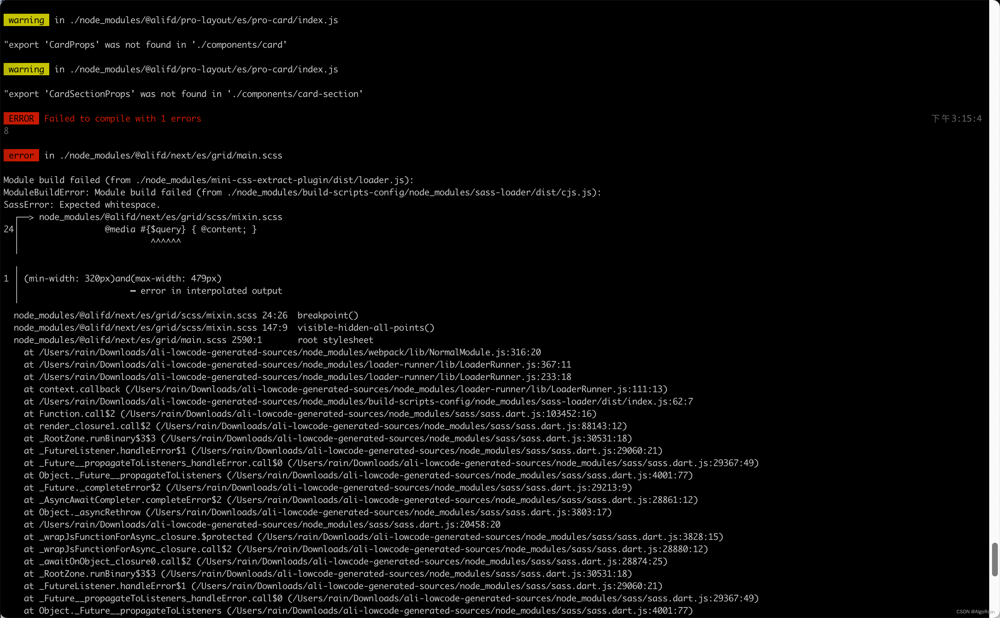
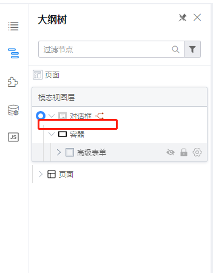
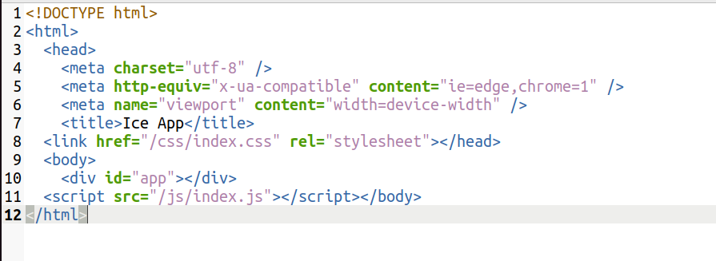

### 1. 向后端发送请求我用的是fetch函数
fetch函数模版
```javascript
async onSearchById(value) {
    var url = "";
    console.log(value.getById)
    if (value.getById) {
        url = 'http://localhost:5050/Test/GetByIdController/id' + '?id=' + value.getById;
    } else {
        url = 'http://localhost:5050/test/getcontroller';
    }
    const { info } = this.state;
    const response = await fetch(url, {
        method: 'POST', //GET, POST, PUT, DELETE, etc.
        mode: 'cors',// no-cors, *cors, same-origin 
        cache: 'no-cache',// default, no-cache, reload, force-cache, only-if-cached
        credentials: 'same-origin',// include, *same-origin, omit
        headers: {
            'Content-Type': 'application/json'
            // 'Content-Type': 'application/x-www-form-urlencoded',
        },
        redirect: 'follow',// manual, *follow, error
        referrerPolicy: 'no-referrer',// noreferrer, *no-refrrer-when-downgrade, origin, origin-when-cross-origin, same-origin, strict-origin,
        //请求体
        body: JSON.stringify({
            id: value.getById
        })
    });
    response.json().then((data) => {
        console.log(data);
        if (data) {
            this.setState({
                info: data.data
            })
            Next.Notification.success({
                title: "成功",
                style: {
                    width: 600,
                    marginLeft: -255
                }
            });
        }
        else {
            Next.Notification.error({
                title: "失败",
                style: {
                    width: 600,
                    marginLeft: -255
                }
            })
        }
    })

}

```

### 2. 响应数据的处理
对于高级表格的数据源必须是数组形式的，每个数组元素对应表格中的一行。在表格中所遍历的数组元素中的字段必须为基本数据类型，不可为数组等其他类型。这里我将响应的数据进行了提取操作，JavaScript不支持内部类，我用的JavaScript中的函数进行保存的（也可以在LowcodeComponent类外面再声明一个类进行映射操作）。
```javascript
  Robot(uuid, ip, current_map, current_group, dispatchable, current_order_id, current_order_state, battery_level, confidence, locked, reloc_status, procBusiness) {
    return {
      "uuid": uuid,
      "ip": ip,
      "current_map": current_map,
      "current_group": current_group,
      "dispatchable":dispatchable,
      "current_order_id": current_order_id,
      "current_order_state": current_order_state,
      "battery_level": battery_level,
      "confidence": confidence,
      "locked": locked,
      "reloc_status": reloc_status,
      "procBusiness": procBusiness
    };
```

### 3. 启动阿里低代码平台报错 error in ./node_modules/@alifd/next/es/grid/main.scss

错误提示是在main.scss这个文件里有一行代码错误了。
所以直接找到这个文件对应的这行，然后把这行删掉
```javascript
@media #{$query} { @content; }
```

### 4. 报错“NextP component is not found in components list!”
高级对话框和高级表单联用会报错
解决方案：手动编辑schema，删除红框处的“段落”可修复


### 5. 前端项目的打包发布
点击出码按钮后会得到一个压缩包，对其进行解压并切换到该目录后，执行命令`npm run build`将会直接进行打包。
命令:
>npm run build

作用：用vue-cli内部集成的webpack，把 .vue, .less, .js 等打包成浏览器可直接执行的代码 html，css，js。

结果：会在项目根目录下创建 /build目录，在这目录下产出打包后的结果。

### 6. build项目之后打开index.html页面没有内容显示
编辑index.html源码,在引用css与js的地方删除第一个斜杠
